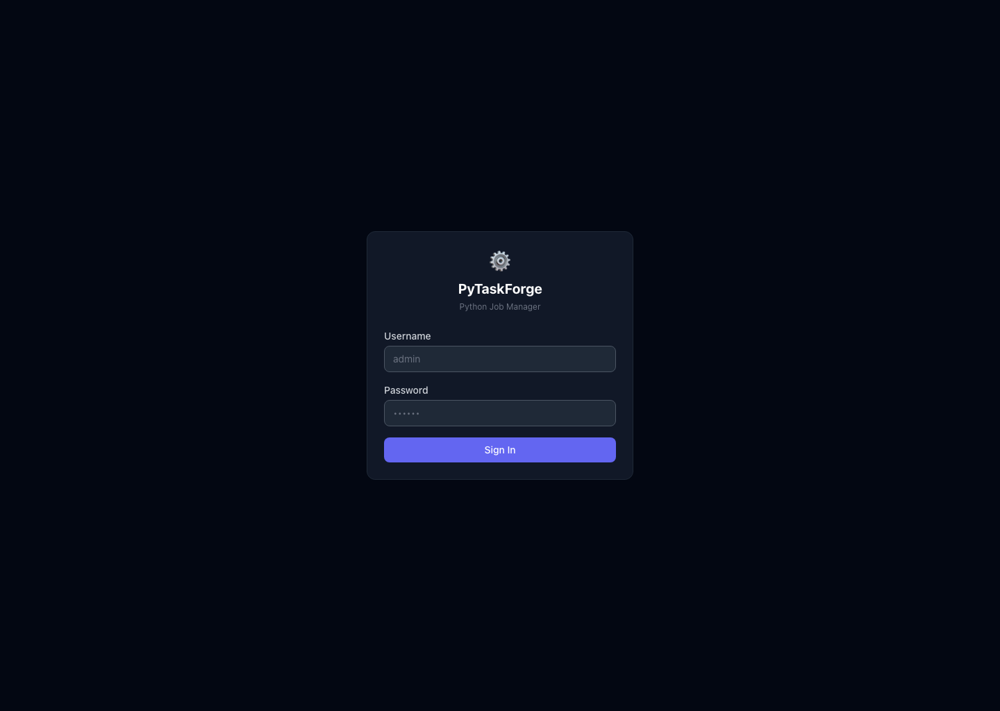
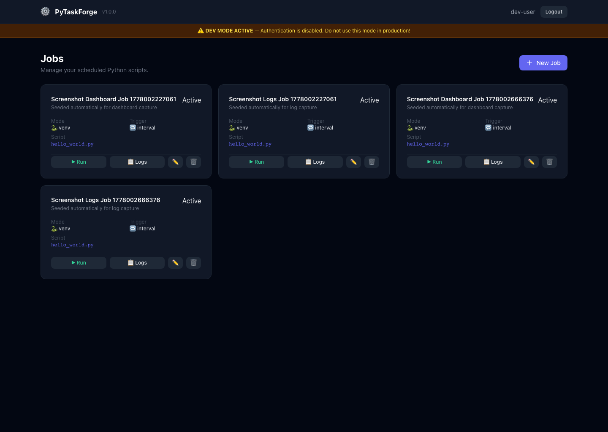
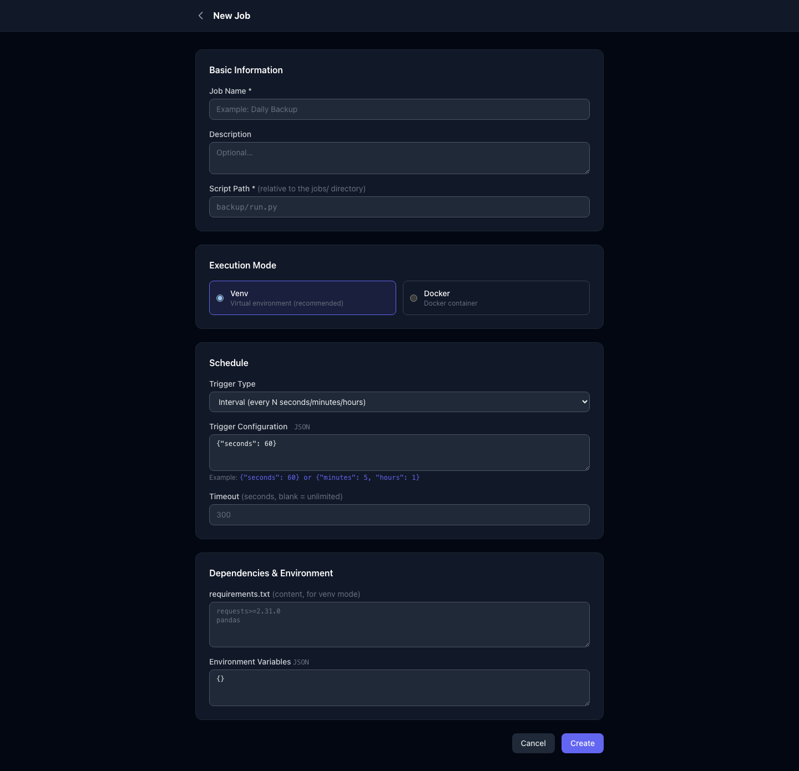
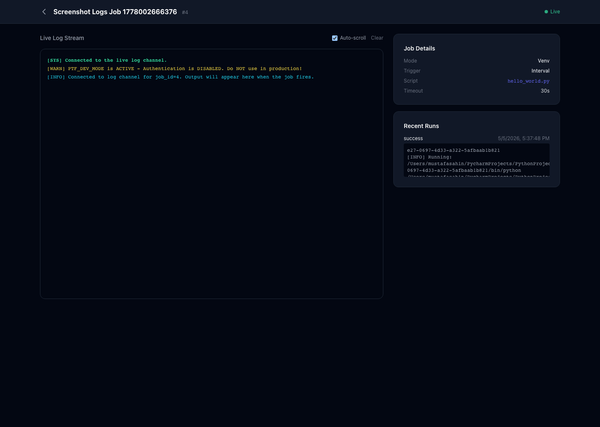
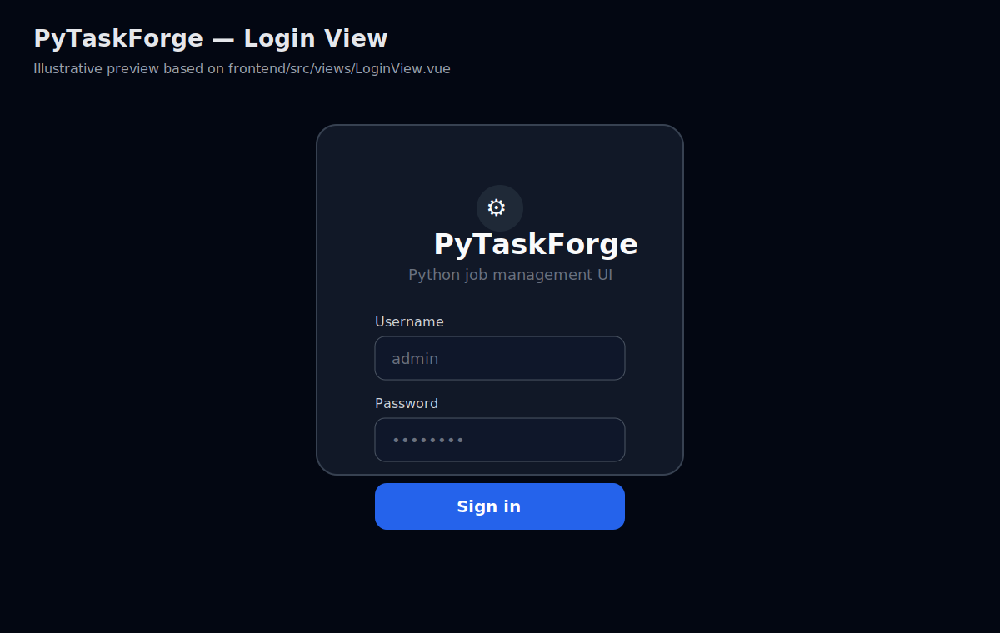
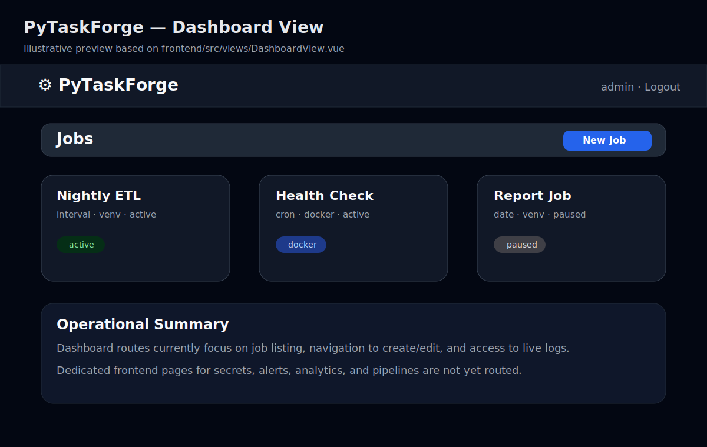
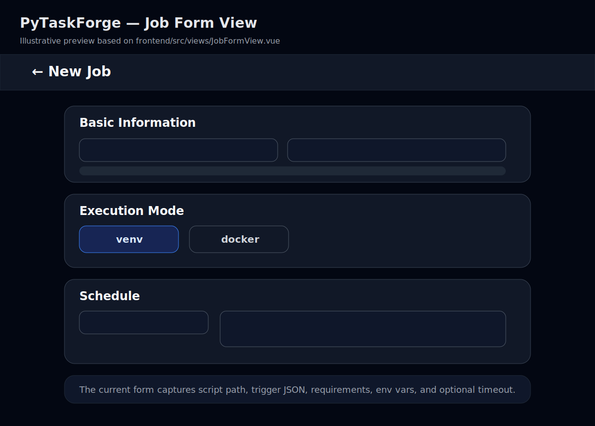
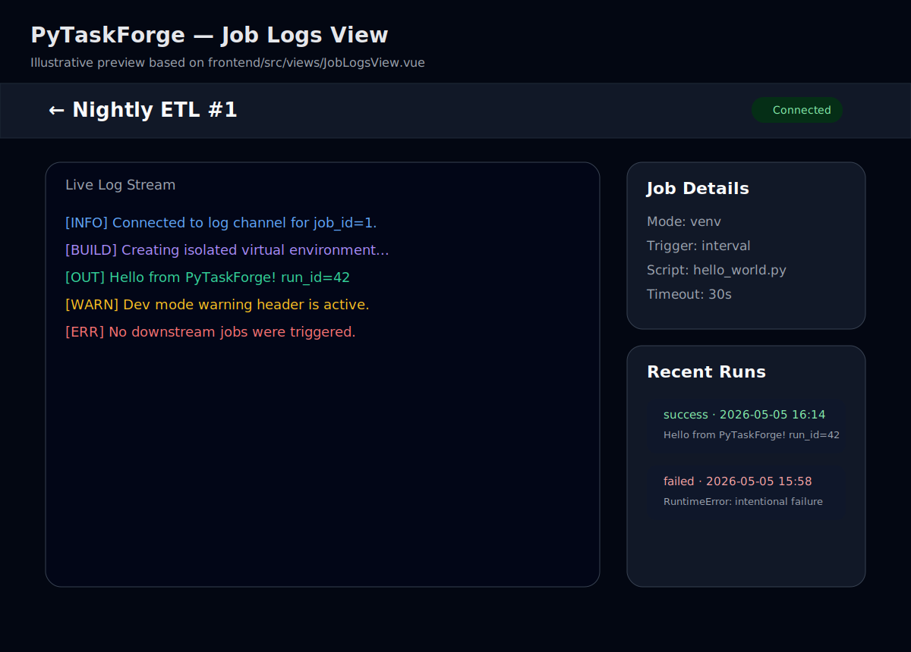
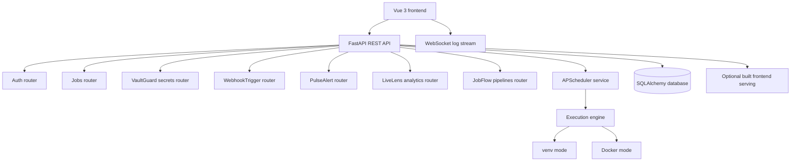

# PyTaskForge

[](https://github.com/coddard/PyTaskForge)
[](https://github.com/coddard/PyTaskForge)
[](https://github.com/coddard/PyTaskForge/issues)
[](https://github.com/coddard/PyTaskForge/commits)

PyTaskForge is a self-hosted Python job scheduler and lightweight orchestration platform built with a FastAPI backend and a Vue 3 frontend. It supports isolated execution via `venv` or Docker, real-time log streaming over WebSockets, run history, encrypted secrets, webhook-triggered runs, alert policies, analytics endpoints, and DAG-style pipelines.

> This README reflects the current repository state as verified from code, tests, and configuration files on **2026-05-05**.

## Table of Contents

- [Why PyTaskForge?](#why-pytaskforge)
- [Verified Capabilities](#verified-capabilities)
  - [1. Core job scheduling and execution](#1-core-job-scheduling-and-execution)
  - [2. VaultGuard: encrypted secrets](#2-vaultguard-encrypted-secrets)
  - [3. JobFlow: dependency-aware pipelines](#3-jobflow-dependency-aware-pipelines)
  - [4. PulseAlert: notifications and SLA monitoring](#4-pulsealert-notifications-and-sla-monitoring)
  - [5. WebhookTrigger: event-driven execution](#5-webhooktrigger-event-driven-execution)
  - [6. LiveLens analytics](#6-livelens-analytics)
  - [7. Live WebSocket log streaming](#7-live-websocket-log-streaming)
- [Current Frontend Scope](#current-frontend-scope)
- [Frontend Screenshots](#frontend-screenshots)
- [Architecture Overview](#architecture-overview)
- [Quick Start](#quick-start)
- [Screenshot Capture Flow](#screenshot-capture-flow)
- [Configuration Reference](#configuration-reference)
- [API Summary](#api-summary)
- [Usage Examples](#usage-examples)
- [Testing](#testing)
- [Detailed Competition Snapshot](#detailed-competition-snapshot)
- [Security Notes](#security-notes)
- [License](#license)

## Why PyTaskForge?

- Self-hosted by default
- Python-first job execution model
- Dual isolation strategy: `venv` or Docker per job
- REST API + WebSocket log streaming
- Run history and operational analytics endpoints
- Encrypted secrets with runtime placeholder resolution
- Event-driven execution via per-job webhook tokens
- Pipeline orchestration with dependency edges and cycle detection
- Per-job alert policies for failures, timeouts, success events, and SLA breaches

## Verified Capabilities

### 1. Core job scheduling and execution

Verified from `backend/routers/jobs.py`, `backend/models/database.py`, and the current frontend views.

- Job CRUD is available under `POST|GET|PUT|DELETE /api/jobs`
- Jobs support `cron`, `interval`, and `date` triggers
- Jobs can be triggered immediately with `POST /api/jobs/{job_id}/run`
- Run history is available via `GET /api/jobs/{job_id}/history`
- Execution mode can be `venv` or `docker`
- Optional per-job timeout is supported

### 2. VaultGuard: encrypted secrets

Verified from `backend/routers/secrets.py`, `backend/core/vault.py`, and `backend/services/secret_resolver.py`.

- Secrets are stored encrypted using Fernet from `cryptography`
- Secret values are write-only through the API
- Runtime placeholders such as `{{ secrets.MY_KEY }}` are resolved before execution
- Missing secret references raise a dedicated resolver error before execution continues

### 3. JobFlow: dependency-aware pipelines

Verified from `backend/routers/pipelines.py`, `backend/services/pipeline_runner.py`, and `tests/test_new_features.py`.

- Pipeline CRUD is available under `/api/pipelines`
- Pipelines store directed edges between existing jobs
- Topological ordering is implemented with Kahn's algorithm
- Circular dependencies return HTTP `422`
- Edge conditions are supported:
  - `success`
  - `failure`
  - `always`

Example pipeline creation:

Dev mode (`PTF_DEV_MODE=true`, token optional):

```bash
curl -X POST http://localhost:8000/api/pipelines \
  -H "Content-Type: application/json" \
  -d '{
    "name": "Nightly ETL",
    "description": "Extract -> Transform -> Load",
    "edges": [
      {"upstream_job_id": 1, "downstream_job_id": 2, "on_condition": "success"},
      {"upstream_job_id": 2, "downstream_job_id": 3, "on_condition": "success"}
    ]
  }'
```

Production mode (JWT required):

```bash
curl -X POST http://localhost:8000/api/pipelines \
  -H "Authorization: Bearer <JWT>" \
  -H "Content-Type: application/json" \
  -d '{
    "name": "Nightly ETL",
    "description": "Extract -> Transform -> Load",
    "edges": [
      {"upstream_job_id": 1, "downstream_job_id": 2, "on_condition": "success"},
      {"upstream_job_id": 2, "downstream_job_id": 3, "on_condition": "success"}
    ]
  }'
```

Trigger a pipeline immediately in dev mode:

```bash
curl -X POST http://localhost:8000/api/pipelines/1/trigger
```

Trigger a pipeline immediately in production mode:

```bash
curl -X POST http://localhost:8000/api/pipelines/1/trigger \
  -H "Authorization: Bearer <JWT>"
```

### 4. PulseAlert: notifications and SLA monitoring

Verified from `backend/routers/alerts.py`, `backend/services/notifier.py`, and `tests/test_new_features.py`.

- Alert policies are attached per job
- Supported channels:
  - `slack`
  - `discord`
  - `email`
  - `webhook`
- Supported triggers:
  - `on_failure`
  - `on_success`
  - `on_timeout`
  - `on_sla_breach`
- Test dispatch is available with `POST /api/jobs/{job_id}/alerts/{alert_id}/test`
- Notification failures are intentionally swallowed so alerts do not break job execution

Example alert policy:

Dev mode (`PTF_DEV_MODE=true`, token optional):

```bash
curl -X POST http://localhost:8000/api/jobs/1/alerts \
  -H "Content-Type: application/json" \
  -d '{
    "channel": "slack",
    "trigger": "on_failure",
    "target_url": "https://hooks.slack.com/services/XXX/YYY/ZZZ",
    "sla_max_duration_seconds": 120,
    "is_active": true
  }'
```

Production mode (JWT required):

```bash
curl -X POST http://localhost:8000/api/jobs/1/alerts \
  -H "Authorization: Bearer <JWT>" \
  -H "Content-Type: application/json" \
  -d '{
    "channel": "slack",
    "trigger": "on_failure",
    "target_url": "https://hooks.slack.com/services/XXX/YYY/ZZZ",
    "sla_max_duration_seconds": 120,
    "is_active": true
  }'
```

Test an alert policy in dev mode:

```bash
curl -X POST http://localhost:8000/api/jobs/1/alerts/1/test
```

Test an alert policy in production mode:

```bash
curl -X POST http://localhost:8000/api/jobs/1/alerts/1/test \
  -H "Authorization: Bearer <JWT>"
```

### 5. WebhookTrigger: event-driven execution

Verified from `backend/routers/webhooks.py` and `tests/test_new_features.py`.

- Public endpoint: `POST /webhooks/jobs/{webhook_token}`
- The webhook token acts as authentication for that endpoint
- The optional JSON body is merged into runtime environment variables for the run
- Disabled or unknown webhook tokens return `404`
- Webhook tokens can be rotated with `POST /api/jobs/{job_id}/webhook/regenerate`

### 6. LiveLens analytics

Verified from `backend/routers/analytics.py` and `tests/test_new_features.py`.

- `GET /api/analytics/summary`
- `GET /api/analytics/jobs/{job_id}/heatmap`
- `GET /api/analytics/jobs/{job_id}/durations`
- `GET /api/analytics/anomalies`

### 7. Live WebSocket log streaming

Verified from `backend/main.py` and `frontend/src/views/JobLogsView.vue`.

- WebSocket endpoint: `ws://<host>/ws/jobs/{job_id}/logs`
- In normal mode, the client passes `?token=<JWT>`
- In dev mode, no token is required and a warning message is sent to the client

## Current Frontend Scope

Verified from `frontend/src/router/index.js` and the current Vue views.

The existing UI currently covers:

- login
- dashboard job list
- create/edit job form
- live job logs view

The backend already exposes APIs for secrets, webhooks, alerts, analytics, and pipelines, but the current routed frontend does **not** yet provide dedicated pages for those features.


## Frontend Screenshots

The repository now includes a **real runtime screenshot flow** plus checked-in fallback previews.

### Runtime captures

| Login | Dashboard |
|---|---|
|  |  |

| Job Form | Live Logs |
|---|---|
|  |  |

### Checked-in fallback previews

If you need deterministic, text-diff-friendly assets in git, the repository also keeps SVG previews derived from the Vue screens:

| Login | Dashboard |
|---|---|
|  |  |

| Job Form | Live Logs |
|---|---|
|  |  |

Current screen-to-file mapping:

- `docs/screenshots/runtime/login-runtime.png` → runtime capture of `frontend/src/views/LoginView.vue`
- `docs/screenshots/runtime/dashboard-runtime.png` → runtime capture of `frontend/src/views/DashboardView.vue`
- `docs/screenshots/runtime/job-form-runtime.png` → runtime capture of `frontend/src/views/JobFormView.vue`
- `docs/screenshots/runtime/job-logs-runtime.png` → runtime capture of `frontend/src/views/JobLogsView.vue`
- `docs/screenshots/login-view.svg` → `frontend/src/views/LoginView.vue`
- `docs/screenshots/dashboard-view.svg` → `frontend/src/views/DashboardView.vue`
- `docs/screenshots/job-form-view.svg` → `frontend/src/views/JobFormView.vue`
- `docs/screenshots/job-logs-view.svg` → `frontend/src/views/JobLogsView.vue`

## Architecture Overview



## Quick Start

### Option A: Docker Compose

```bash
cd /Users/mustafasahin/PycharmProjects/PythonProject1/pytaskforge
cp .env.example .env
python -c "import secrets; print(secrets.token_urlsafe(64))"
python -c "from cryptography.fernet import Fernet; print(Fernet.generate_key().decode())"
docker compose up --build
```

### Option B: Local development

Backend:

```bash
cd /Users/mustafasahin/PycharmProjects/PythonProject1/pytaskforge
python -m venv .venv
source .venv/bin/activate
pip install -r requirements.txt
uvicorn backend.main:app --host 0.0.0.0 --port 8000
```

Frontend in a separate terminal:

```bash
cd /Users/mustafasahin/PycharmProjects/PythonProject1/pytaskforge/frontend
npm install
npm run dev
```

If `frontend/dist` exists, `backend/main.py` will also serve the built frontend from `/`.

## Screenshot Capture Flow

Real PNG screenshots can be regenerated from a running PyTaskForge instance using the Playwright-based flow in `frontend/scripts/capture-screenshots.mjs`.

### What the script does

- waits for the backend API and frontend UI to become reachable
- requests a JWT from `/api/auth/token`
- seeds a small set of real jobs through the API
- triggers a real run for the logs page capture
- saves PNG outputs into `docs/screenshots/runtime`

### Install the capture dependency

```bash
cd /Users/mustafasahin/PycharmProjects/PythonProject1/pytaskforge/frontend
npm install
npm run capture:screenshots:install
```

### Start the app for capture

Backend:

```bash
cd /Users/mustafasahin/PycharmProjects/PythonProject1/pytaskforge
PTF_DEV_MODE=true DATABASE_URL=sqlite+aiosqlite:///./capture_screenshots.db uvicorn backend.main:app --host 127.0.0.1 --port 8000
```

Frontend:

```bash
cd /Users/mustafasahin/PycharmProjects/PythonProject1/pytaskforge/frontend
npm run dev -- --host 127.0.0.1
```

### Generate the screenshots

```bash
cd /Users/mustafasahin/PycharmProjects/PythonProject1/pytaskforge/frontend
PTF_SCREENSHOT_UI_BASE_URL=http://127.0.0.1:5173 \
PTF_SCREENSHOT_API_BASE_URL=http://127.0.0.1:8000/api \
PTF_SCREENSHOT_DEV_MODE=true \
npm run capture:screenshots
```

Optional overrides:

- `PTF_SCREENSHOT_UI_BASE_URL`
- `PTF_SCREENSHOT_API_BASE_URL`
- `PTF_SCREENSHOT_USERNAME`
- `PTF_SCREENSHOT_PASSWORD`
- `PTF_SCREENSHOT_DEV_MODE`

More detail is documented in `docs/screenshots/README.md`.

## Configuration Reference

The project ships with a verified `.env.example`. Key variables are listed below.

| Variable | Purpose | Default / Example | Notes |
|---|---|---:|---|
| `APP_NAME` | API title | `PyTaskForge` | Reflected in FastAPI docs |
| `APP_VERSION` | Backend version | `2.0.0` | Loaded from `backend/core/config.py` |
| `DEBUG` | Verbose application behavior | `false` | Enables more verbose logging and SQL echo |
| `PTF_DEV_MODE` | Disable authentication | `false` | Must never be enabled in production |
| `SECRET_KEY` | JWT signing key | generated externally | Required when `PTF_DEV_MODE=false` |
| `ACCESS_TOKEN_EXPIRE_MINUTES` | JWT lifetime | `480` | 8 hours by default |
| `DATABASE_URL` | Database connection string | `sqlite+aiosqlite:///./pytaskforge.db` | SQLite is the verified default |
| `JOBS_DIR` | Root directory for job scripts | repo `jobs/` directory | Created automatically by settings validation |
| `VENV_BASE_DIR` | Base path for virtual environments | repo `.venvs/` directory | Created automatically by settings validation |
| `DOCKER_DEFAULT_IMAGE` | Default Docker runtime image | `python:3.11-slim` | Used for Docker mode jobs |
| `DOCKER_NETWORK` | Docker network isolation | `none` | Stronger isolation by default |
| `DOCKER_MEM_LIMIT` | Docker memory cap | `256m` | Runtime guardrail |
| `DOCKER_CPU_QUOTA` | Docker CPU quota | `50000` | 50% of one core with default period |
| `CORS_ORIGINS` | Allowed browser origins | localhost defaults | Passed directly into FastAPI CORS middleware |
| `MAX_CONCURRENT_JOBS` | Maximum simultaneous jobs | `10` | Scheduler-side concurrency control |
| `LOG_FORMAT` | Log output format | `text` | Supports `text` or `json` |
| `VAULT_ENCRYPTION_KEY` | VaultGuard encryption key | external secret | Required for secrets functionality |

## API Summary

### Auth

- `POST /api/auth/token`
- `GET /api/auth/me`

### Health and docs

- `GET /api/health`
- `GET /api/docs`
- `GET /api/redoc`
- `GET /api/openapi.json`

### Jobs

- `GET /api/jobs`
- `POST /api/jobs`
- `GET /api/jobs/{job_id}`
- `PUT /api/jobs/{job_id}`
- `DELETE /api/jobs/{job_id}`
- `POST /api/jobs/{job_id}/run`
- `GET /api/jobs/{job_id}/history`
- `POST /api/jobs/{job_id}/webhook/regenerate`

### Secrets

- `POST /api/secrets`
- `GET /api/secrets`
- `DELETE /api/secrets/{secret_name}`

### Webhooks

- `POST /webhooks/jobs/{webhook_token}`

### Alerts

- `GET /api/jobs/{job_id}/alerts`
- `POST /api/jobs/{job_id}/alerts`
- `PUT /api/jobs/{job_id}/alerts/{alert_id}`
- `DELETE /api/jobs/{job_id}/alerts/{alert_id}`
- `POST /api/jobs/{job_id}/alerts/{alert_id}/test`

### Analytics

- `GET /api/analytics/summary`
- `GET /api/analytics/jobs/{job_id}/heatmap`
- `GET /api/analytics/jobs/{job_id}/durations`
- `GET /api/analytics/anomalies`

### Pipelines

- `GET /api/pipelines`
- `POST /api/pipelines`
- `GET /api/pipelines/{pipeline_id}`
- `PUT /api/pipelines/{pipeline_id}`
- `DELETE /api/pipelines/{pipeline_id}`
- `POST /api/pipelines/{pipeline_id}/trigger`

### WebSocket

- `GET ws://<host>/ws/jobs/{job_id}/logs`

## Usage Examples

### Authentication bootstrap

#### Dev mode

In dev mode, protected endpoints are open and a JWT is still easy to obtain for tooling or frontend-like flows:

```bash
export API_BASE="http://localhost:8000"

export JWT="$(curl -s -X POST "$API_BASE/api/auth/token" \
  -H "Content-Type: application/x-www-form-urlencoded" \
  --data-urlencode "username=anything" \
  --data-urlencode "password=anything" | \
  python3 -c 'import sys, json; print(json.load(sys.stdin)["access_token"])')"
```

#### Production mode

In production mode, use real credentials and always pass the token to protected routes:

```bash
export API_BASE="http://localhost:8000"
export PTF_USERNAME="admin"
export PTF_PASSWORD="replace-with-your-real-password"

export JWT="$(curl -s -X POST "$API_BASE/api/auth/token" \
  -H "Content-Type: application/x-www-form-urlencoded" \
  --data-urlencode "username=$PTF_USERNAME" \
  --data-urlencode "password=$PTF_PASSWORD" | \
  python3 -c 'import sys, json; print(json.load(sys.stdin)["access_token"])')"
```

### Create a job

Dev mode:

```bash
curl -X POST "$API_BASE/api/jobs" \
  -H "Content-Type: application/json" \
  -d '{
    "name": "Hello World",
    "description": "Simple interval job",
    "script_path": "hello_world.py",
    "execution_mode": "venv",
    "trigger_type": "interval",
    "trigger_config": {"seconds": 60},
    "requirements": null,
    "env_vars": {"EXAMPLE": "1"},
    "timeout_seconds": 30
  }'
```

Production mode:

```bash
curl -X POST "$API_BASE/api/jobs" \
  -H "Authorization: Bearer $JWT" \
  -H "Content-Type: application/json" \
  -d '{
    "name": "Hello World",
    "description": "Simple interval job",
    "script_path": "hello_world.py",
    "execution_mode": "venv",
    "trigger_type": "interval",
    "trigger_config": {"seconds": 60},
    "requirements": null,
    "env_vars": {"EXAMPLE": "1"},
    "timeout_seconds": 30
  }'
```

### Create or update a secret

Dev mode:

```bash
curl -X POST "$API_BASE/api/secrets" \
  -H "Content-Type: application/json" \
  -d '{
    "name": "API_TOKEN",
    "value": "super-secret-value"
  }'
```

Production mode:

```bash
curl -X POST "$API_BASE/api/secrets" \
  -H "Authorization: Bearer $JWT" \
  -H "Content-Type: application/json" \
  -d '{
    "name": "API_TOKEN",
    "value": "super-secret-value"
  }'
```

### Trigger a job through its webhook token with runtime parameters

This example is the same in dev mode and production mode because the webhook token itself is the authentication mechanism.

```bash
curl -X POST "$API_BASE/webhooks/jobs/<WEBHOOK_TOKEN>" \
  -H "Content-Type: application/json" \
  -d '{
    "GIT_SHA": "abc123",
    "BRANCH": "main"
  }'
```

## Testing

Run the full test suite:

```bash
cd /Users/mustafasahin/PycharmProjects/PythonProject1/pytaskforge
pytest
```

Run the feature-focused tests:

```bash
cd /Users/mustafasahin/PycharmProjects/PythonProject1/pytaskforge
pytest -q tests/test_new_features.py
```

`tests/test_new_features.py` currently covers:

- WebhookTrigger
- PulseAlert
- LiveLens analytics
- JobFlow pipelines

## Detailed Competition Snapshot

This section combines:

1. live metadata gathered on **2026-05-05** from GitHub and PyPI, and
2. qualitative capability notes already documented in `report.md`.

### Market metadata snapshot

| Product | Repository | GitHub Stars* | Latest Stable Version / Release | Version Source | Snapshot Date | Notes |
|---|---|---:|---|---|---|---|
| PyTaskForge[^ptf-meta] | local repository | N/A | backend `2.0.0`, frontend package `1.0.0` | local config + package metadata | 2026-05-05 | Self-hosted Python scheduler with dual execution isolation |
| Apache Airflow[^airflow-meta] | `apache/airflow` | 45,287 | `3.2.1` | PyPI + core GitHub release | 2026-05-05 | Mature DAG scheduler, but typically heavier to operate |
| Prefect[^prefect-meta] | `PrefectHQ/prefect` | 22,306 | `3.6.29` | PyPI + GitHub release | 2026-05-05 | Strong cloud-led orchestration and developer experience |
| Dagster[^dagster-meta] | `dagster-io/dagster` | 15,431 | `1.13.3` | PyPI + GitHub release | 2026-05-05 | Strong observability and asset-oriented workflow model |
| Windmill[^windmill-meta] | `windmill-labs/windmill` | 16,406 | `v1.695.0` | GitHub release | 2026-05-05 | Strong in-browser scripting and app-builder UX |
| Kestra[^kestra-meta] | `kestra-io/kestra` | 26,790 | `v1.3.15` | core GitHub release | 2026-05-05 | Strong event-driven automation and plugin ecosystem |

\* GitHub stars are point-in-time snapshots and will change continuously.

For repositories that publish subproject releases in the same feed, this table intentionally uses the core application release when it can be identified from the live release list.

### Capability comparison snapshot[^capability-matrix]

| Capability | PyTaskForge | Airflow | Prefect | Dagster | Windmill | Kestra |
|---|---|---|---|---|---|---|
| Python-native script execution | **Yes** | Yes | Yes | Yes | Partial | Partial |
| `venv` execution isolation | **Yes** | No | No | No | No | No |
| Docker execution option | **Yes** | Yes | Yes | Yes | Yes | Yes |
| Encrypted secrets manager | **Yes** | Partial | Yes | Yes | Yes | Yes |
| Webhook-triggered runs | **Yes** | Partial | Yes | Partial | Yes | Yes |
| Per-job alert policies | **Yes** | Yes | Yes | Yes | Partial | Yes |
| Analytics endpoints in core repo | **Yes** | Partial | Yes | Yes | Partial | Yes |
| DAG / dependency graph support | **Yes** | Yes | Yes | Yes | Partial | Yes |
| Runtime parameter injection | Partial | Partial | Yes | Yes | Yes | Yes |
| In-browser script editor | No | No | Partial | No | Yes | Partial |
| RBAC / team model | No | Partial | Yes | Yes | Yes | Partial |
| Git-backed script management | No | Partial | Yes | Yes | Yes | Partial |

### Where PyTaskForge stands out

- Simpler self-hosted footprint than many larger orchestration stacks
- Verified dual execution model in a single product: `venv` plus Docker
- Strong combination of recent features in one codebase: VaultGuard + WebhookTrigger + PulseAlert + LiveLens + JobFlow
- Real-time WebSocket log streaming built directly into the application entrypoint

[^ptf-meta]: Local sources used for this row: `backend/core/config.py` (`APP_VERSION=2.0.0`), `frontend/package.json` (`version=1.0.0`), and the local git remote origin `https://github.com/coddard/PyTaskForge.git`.

[^airflow-meta]: Live metadata snapshot collected on 2026-05-05 from the Apache Airflow GitHub repository (`https://github.com/apache/airflow`) and PyPI package page (`https://pypi.org/project/apache-airflow/`). The core `3.2.1` release was used instead of subproject feed entries such as Helm chart releases.

[^prefect-meta]: Live metadata snapshot collected on 2026-05-05 from the Prefect GitHub repository (`https://github.com/PrefectHQ/prefect`) and PyPI package page (`https://pypi.org/project/prefect/`).

[^dagster-meta]: Live metadata snapshot collected on 2026-05-05 from the Dagster GitHub repository (`https://github.com/dagster-io/dagster`) and PyPI package page (`https://pypi.org/project/dagster/`).

[^windmill-meta]: Live metadata snapshot collected on 2026-05-05 from the Windmill GitHub repository (`https://github.com/windmill-labs/windmill`). Version information in the table comes from the current GitHub release feed.

[^kestra-meta]: Live metadata snapshot collected on 2026-05-05 from the Kestra GitHub repository (`https://github.com/kestra-io/kestra`). The table uses the core `v1.3.15` release because the release feed also contains subproject entries such as design-system packages.

[^capability-matrix]: Qualitative capability comparison synthesized from `report.md` (especially sections 1–3) plus the verified shape of the current PyTaskForge codebase. In this matrix, `Partial` means the capability exists through plugins, product tiers, alternative workflow models, or an implementation that does not map 1:1 to PyTaskForge's current built-in behavior.

## Security Notes

- `PTF_DEV_MODE=true` disables authentication and should never be used in production.
- In non-dev mode, `SECRET_KEY` must be explicitly configured or startup will fail.
- `VAULT_ENCRYPTION_KEY` must be set before using the secrets feature.
- In dev mode, HTTP responses include the `X-Dev-Mode-Warning` header.
- In normal mode, the log WebSocket requires a JWT passed as `?token=<JWT>`.

## License

MIT
